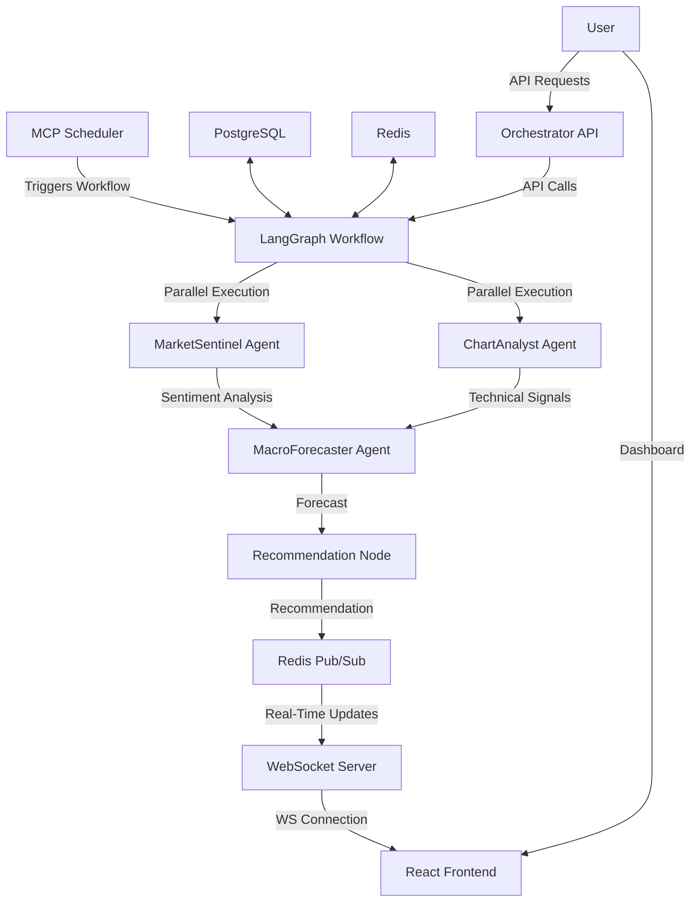
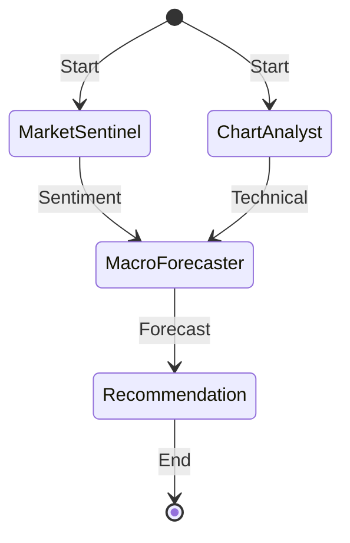
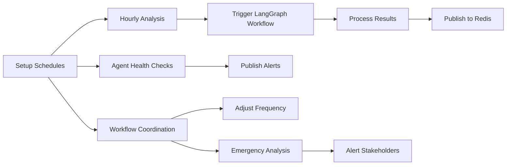
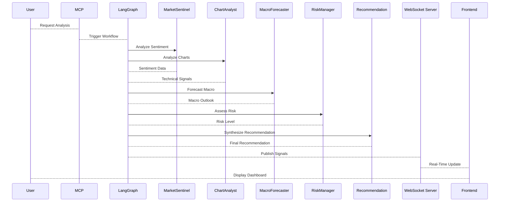

# Agentic Trading Workflow System

 

A sophisticated agentic trading platform leveraging LangGraph for workflow orchestration, MCP Scheduler for task management, and multiple AI agents for market analysis and trading recommendations. This system integrates real-time market data, sentiment analysis, technical indicators, macro forecasting, and risk management to generate actionable trading signals. The backend is built with FastAPI, Redis, and PostgreSQL, while the frontend uses React with WebSocket for live updates.

## Table of Contents
- [Project Description](#project-description)
- [Architecture Overview](#architecture-overview)
  - [Overall Orchestration Flow](#overall-orchestration-flow)
  - [LangGraph Workflow Illustration](#langgraph-workflow-illustration)
  - [MCP Scheduler Process](#mcp-scheduler-process)
  - [Agentic Process Diagram](#agentic-process-diagram)
- [Features](#features)
- [Tech Stack](#tech-stack)
- [Installation](#installation)
- [Configuration](#configuration)
- [Running the Project](#running-the-project)
  - [Backend](#backend)
  - [Frontend](#frontend)
- [Usage](#usage)
- [API Endpoints](#api-endpoints)
- [Frontend Integration](#frontend-integration)
- [Contributing](#contributing)
- [License](#license)
- [Acknowledgements](#acknowledgements)

## Project Description

The Agentic Trading Workflow System is an autonomous trading platform that combines AI agents with graph-based workflows to provide comprehensive trading analysis and recommendations. It uses LangGraph for dynamic workflow orchestration, allowing parallel and sequential execution of agent tasks. The MCP Scheduler handles scheduling and coordination of periodic analyses, while agents like ChartAnalyst, MarketSentinel, MacroForecaster, RiskManager, and others provide specialized insights.

Key capabilities:
- Real-time market data fetching and analysis
- Sentiment analysis from news and social media
- Technical pattern recognition and trend detection
- Macro economic forecasting
- Risk assessment and position sizing
- Trading recommendation generation
- Live updates via WebSocket to the frontend dashboard
- Persistent storage in PostgreSQL and caching in Redis

This system is designed for scalability, with Docker Compose for easy deployment and a modular agent architecture for extension.

## Architecture Overview

The system follows a microservices architecture with Dockerized services communicating via Redis pub/sub and FastAPI APIs. The frontend connects via WebSocket for real-time updates.

### Overall Orchestration Flow

The orchestration involves the MCP Scheduler triggering workflows in LangGraph, which coordinates agents and publishes results to Redis for frontend consumption.



### LangGraph Workflow Illustration

LangGraph handles the core trading workflow as a graph of agents.



### MCP Scheduler Process

The MCP Scheduler manages periodic tasks and health checks.



### Agentic Process Diagram

The agentic process involves multiple specialized agents collaborating.



## Features

- **Agentic Workflow**: Autonomous agents for sentiment, technical, macro, and risk analysis.
- **LangGraph Orchestration**: Dynamic graph-based workflow for parallel and sequential agent execution.
- **MCP Scheduler**: Scheduled tasks for hourly analysis, health checks, and emergency triggers.
- **Real-Time Updates**: WebSocket integration for live trading signals and dashboard updates.
- **Frontend Dashboard**: React-based UI with charts for PnL, trades, and agent signals.
- **Data Persistence**: PostgreSQL for storing analysis results and Redis for caching/pub/sub.
- **Health Checks**: Built-in health endpoints for all services.
- **Scalability**: Dockerized services with Compose for easy deployment.
- **Extensibility**: Modular agents and workflow nodes for adding new analysis components.

## Tech Stack

- **Backend**: Python 3.11, FastAPI, LangGraph, Uvicorn, Redis, PostgreSQL, yfinance, numpy, pandas
- **Frontend**: React, Vite, Recharts, Lucide Icons
- **Orchestration**: LangGraph for workflows, MCP Scheduler for scheduling
- **Agents**: ChartAnalyst, MarketSentinel, MacroForecaster, RiskManager
- **Deployment**: Docker Compose, with multi-stage Dockerfiles for efficient builds
- **Logging**: Built-in Python logging with configurable levels
- **Environment**: Ubuntu x86_64, compatible with Docker

## Installation

1. **Clone the Repository**:
   ```bash
   git clone https://github.com/yourusername/agentic-trading-workflow.git
   cd agentic-trading-workflow
   ```

2. **Install Dependencies**:
   - Backend: Dependencies are handled by Docker, but for development:
     ```bash
     cd backend
     pip install -r requirements.txt
     cd automation
     pip install -r requirements.txt
     ```
   - Frontend:
     ```bash
     cd frontend
     npm install
     ```

3. **Set Environment Variables**:
   Create `.env` in the root directory:
   ```text
   OPENROUTER_API_KEY=your_openrouter_api_key
   GEMINI_API_KEY=your_gemini_api_key
   TAVILY_API_KEY=your_tavily_api_key
   REACT_APP_WS_URL=ws://localhost:8008/ws
   ```
   - Fix line endings:
     ```bash
     dos2unix .env
     ```
     Or:
     ```bash
     sed -i 's/\r$//' .env
     ```

4. **Install `dos2unix`** (for line ending fixes):
   ```bash
   sudo apt-get update
   sudo apt-get install -y dos2unix
   ```

## Configuration

- **Docker Compose**: The `docker-compose.yml` defines all services, including agents, orchestration, and infra. Update ports or volumes as needed.
- **Agent Models**: Environment variables like `CHARTANALYST_MODEL`, `RISKMGR_MODEL` in `docker-compose.yml` configure agent LLMs.
- **Frontend WS URL**: Set `REACT_APP_WS_URL=ws://localhost:8008/ws` for local development.

## Running the Project

### Backend
1. **Start Services**:
   ```bash
   docker-compose up --build -d
   ```

2. **Verify Services**:
   - Redis: `docker ps | grep redis`
   - PostgreSQL: `docker ps | grep postgres`
   - WebSocket Server: `curl http://localhost:8008/health`
   - LangGraph Workflow: `curl http://localhost:8009/health`
   - MCP Scheduler: `curl http://localhost:8090/health`
   - Orchestrator: `curl http://localhost:8007/health`

3. **Test Analysis**:
   ```bash
   curl -X POST http://localhost:8009/analyze -H "Content-Type: application/json" -d '{"symbol":"BTC-USD","timeframe":"1h"}'
   ```

### Frontend
1. **Start Development Server**:
   ```bash
   cd frontend
   npm run dev
   ```

2. **Access Dashboard**:
   - Open `http://localhost:5173` (or your Vite port).
   - The dashboard will connect to the WebSocket server for live updates.

3. **Build for Production**:
   ```bash
   npm run build
   ```

## Usage

1. **Trigger Analysis**:
   - Use the `/analyze` endpoint or MCP Scheduler for scheduled analyses.
   - Results are published to Redis and relayed via WebSocket to the frontend.

2. **Frontend Dashboard**:
   - Displays PnL and trade counts in a line chart.
   - Shows agent signals (buy, sell, neutral) in a bar chart.
   - WebSocket status indicator.

3. **Extend Agents**:
   - Add new agents by extending the base in `backend/agents` and updating `docker-compose.yml`.

4. **Customize Workflow**:
   - Modify nodes in `trading_workflow.py` to add or change analysis steps.
   - Update the LangGraph workflow in `build_trading_workflow` for new edges or nodes.

## API Endpoints

- **/health**: GET - Health check for the service.
- **/analyze**: POST - Trigger trading analysis.
  - Body: `{"symbol": "BTC-USD", "timeframe": "1h"}`
  - Response: Full trading state with recommendation.

- **/ws**: WebSocket - Real-time updates (optional).

## Frontend Integration

The frontend uses a WebSocket client (`SignalWebSocket`) to connect to `ws://localhost:8008/ws` and listen for `trade_update` and `agent_signal` messages. The backend publishes these messages to Redis, which the `websocket_server` relays to connected clients. The `App.jsx` dashboard updates charts dynamically with received data.

For debugging:
- Browser console: Check for `✅ WebSocket connected successfully` and message logs.
- Backend logs: Verify published messages in `trading_workflow.py`.

## Contributing

1. Fork the repository.
2. Create a feature branch (`git checkout -b feature/AmazingFeature`).
3. Commit changes (`git commit -m 'Add AmazingFeature'`).
4. Push to the branch (`git push origin feature/AmazingFeature`).
5. Open a Pull Request.

Please include detailed descriptions and tests for new features or bug fixes.

## License

MIT License - see LICENSE file for details.

## Acknowledgements

- LangGraph for workflow orchestration.
- FastAPI for the API framework.
- React and Recharts for frontend visualization.
- Redis and PostgreSQL for data management.

---
