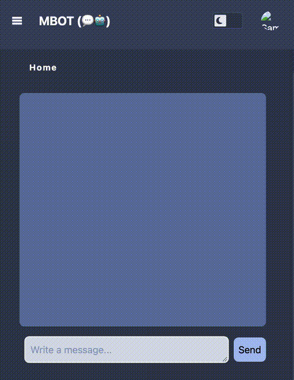

# mbot: For Svelte and FastAPI Chat with OpenAI

[](LICENSE)

## Overview

**mbot** is an open-source starter project for building AI-powered chatbot applications. Combining a modern tech stack of **Svelte** for the frontend and **FastAPI** for the backend, it provides Firebase authentication and integrates seamlessly with OpenAI APIs.

This project is designed for:

- **AI startup enthusiasts** building chat applications.
- **Developers** exploring Svelte and FastAPI.
- **Hobbyists** experimenting with OpenAI's GPT models.

---

## Features

- Modern Frontend: Built with SvelteKit for reactive UI.  
- FastAPI Backend: Async API integration with OpenAI.  
- Secure Authentication: Firebase for user authentication.  
- Boilerplate for AI Apps: A great foundation for interactive AI chat solutions.  

---

## Demo



---

## Table of Contents

1. [Features](#features)  
2. [Getting Started](#getting-started)  
3. [Project Structure](#project-structure)  
4. [Environment Variables](#environment-variables)  
5. [Running the Project](#running-the-project)  
6. [Contributing](#contributing)  
7. [License](#license)  

---

## Getting Started

### Prerequisites

1. Node.js  
    Install from [Node.js official site](https://nodejs.org).
2. Python  
    Install from [Python's official site](https://www.python.org).
3. Firebase Project  
    Create a Firebase project for authentication (free tier is sufficient).
4. OpenAI API Key  
    Obtain an API key from [OpenAI's platform](https://platform.openai.com).

### Installation

#### 1. Clone the Repository

```bash
    git clone https://github.com/mthomason/mbot.git  
    cd mbot  
```

#### 2. Set Up the Backend

```bash
cd backend  
python -m venv venv  
source venv/bin/activate (On Windows: venv\Scripts\activate)  
pip install -r requirements.txt  
```

#### 3. Set Up the Frontend

```bash
cd frontend
npm install
```

#### 4. Add your Environment Variables

See Environment Variables

#### 5. Run the project (see Running the Project)

---

## Project Structure

```bash
frontend/         # SvelteKit app for the UI
backend/          # FastAPI app for APIs
backend/app/      # FastAPI endpoints and logic
backend/mserv/    # Backend utilities and config
electron/         # Optional Electron app (if applicable)
docs/             # Documentation files
```

---

## Environment Variables

Create a `.env` file in the root directory and set the following:  

```bash
GOOGLE_PROJECT_ID_MBOT=your-firebase-project-id  
OPENAI_API_KEY_MBOT=your-openai-api-key  
```

- GOOGLE_PROJECT_ID_MBOT: Firebase project ID for authentication.  
- OPENAI_API_KEY_MBOT: API key for OpenAI services (note: usage may incur costs).  

---

## Running the Project

Use the provided VSCode debug configuration for ease of use. Follow these steps:  

1. Open the project in VSCode.  
2. Select the `Launch mbot client and server` configuration.  
3. Press F5 to start debugging.  

Alternatively, run the components manually:  

### Backend

```bash
cd backend
source venv/bin/activate
uvicorn main:fastapi_app --reload
```

### Frontend

```bash
cd frontend
npm run dev
```

---

## Contributing

Contributions are welcome! Please fork the repo and submit a pull request. Before contributing, make sure to:  

1. Write clear documentation for new features.  
2. Follow the existing code style.  

---

## License

This project is licensed under the MIT License. See the [LICENSE](LICENSE) file for details.

---
